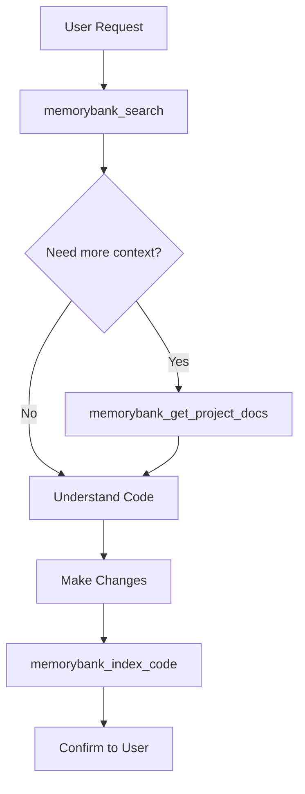

# AGENTS.md - Memory Bank Auto-Index Mode

## Project Configuration

- **Project ID**: `{{PROJECT_ID}}`
- **Workspace**: `{{WORKSPACE_PATH}}`

---

## Memory Bank MCP Instructions

This project uses Memory Bank MCP with **automatic indexing**. The agent MUST keep the Memory Bank synchronized with all code changes.

### CRITICAL: Always Consult Before Acting

Before ANY action, you MUST search the Memory Bank:

```json
{
  "projectId": "{{PROJECT_ID}}",
  "query": "describe what you're looking for"
}
```

For project overview or architecture questions:
```json
{
  "projectId": "{{PROJECT_ID}}",
  "document": "summary"
}
```

### Auto-Indexing Policy

**AFTER EVERY file modification you make, you MUST immediately reindex:**

```json
{
  "projectId": "{{PROJECT_ID}}",
  "path": "path/to/modified/file.ts"
}
```

This is **mandatory** - no exceptions. The Memory Bank must always reflect the current state of the code.

### Workflow



### Standard Workflow Steps

1. **Search**: `memorybank_search` → understand existing code
2. **Context** (if needed): `memorybank_get_project_docs` → architecture overview
3. **Read** (if needed): `memorybank_read_file` → full file content
4. **Modify**: Make your code changes
5. **Reindex**: `memorybank_index_code` → update Memory Bank
6. **Confirm**: Report changes to user

### Session Start

At the beginning of each session:

1. Get project overview:
   ```json
   {
     "projectId": "{{PROJECT_ID}}",
     "document": "activeContext"
   }
   ```

2. Check indexing coverage:
   ```json
   {
     "projectId": "{{PROJECT_ID}}"
   }
   ```

### Multiple File Changes

If you modify multiple files in one operation:

```json
{
  "projectId": "{{PROJECT_ID}}",
  "path": "src/",
  "forceReindex": true
}
```

Or index each file individually for more granular tracking.

---

## Project-Specific Instructions

<!-- Add your project-specific instructions below -->

### Build Commands
- Install: `npm install`
- Build: `npm run build`
- Test: `npm test`

### Code Style
- Follow existing patterns in the codebase
- Use TypeScript strict mode
- Prefer functional patterns

### Important Directories
- `src/` - Source code
- `tests/` - Test files
- `docs/` - Documentation

---

## Notes

- This is **Auto-Index Mode**: all changes are automatically indexed
- The agent proactively keeps the Memory Bank synchronized
- Every modification triggers a reindex
- All operations use `projectId: "{{PROJECT_ID}}"`
