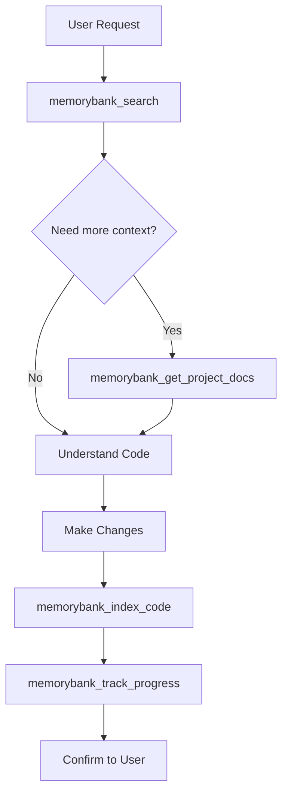

# AGENTS.md - Memory Bank Auto-Index Mode

## Project Configuration

- **Project ID**: `{{PROJECT_ID}}`
- **Workspace**: `{{WORKSPACE_PATH}}`

---

## Memory Bank MCP Instructions

This project uses Memory Bank MCP with **automatic indexing**. The agent MUST keep the Memory Bank synchronized with all code changes.

### Available Tools

#### Core Memory Bank (Semantic Search)
| Tool | Description |
|------|-------------|
| `memorybank_index_code` | Index code semantically for search |
| `memorybank_search` | Semantic search in indexed code |
| `memorybank_read_file` | Read file contents |
| `memorybank_write_file` | Write files with auto-reindexing |
| `memorybank_get_stats` | Get Memory Bank statistics |
| `memorybank_analyze_coverage` | Analyze indexing coverage |

#### Project Knowledge Layer (AI Documentation)
| Tool | Description |
|------|-------------|
| `memorybank_generate_project_docs` | Generate AI documentation |
| `memorybank_get_project_docs` | Read project documentation |

#### Context Management (Session Tracking)
| Tool | Description |
|------|-------------|
| `memorybank_initialize` | Initialize Memory Bank for a new project |
| `memorybank_update_context` | Update active context with session info |
| `memorybank_record_decision` | Record technical decisions |
| `memorybank_track_progress` | Update progress tracking |

#### MCP Resources (Direct Access)
| Resource URI | Content |
|--------------|---------|
| `memory://{{PROJECT_ID}}/active` | Current session context |
| `memory://{{PROJECT_ID}}/progress` | Progress tracking |
| `memory://{{PROJECT_ID}}/decisions` | Decision log |
| `memory://{{PROJECT_ID}}/context` | Project context |
| `memory://{{PROJECT_ID}}/patterns` | System patterns |
| `memory://{{PROJECT_ID}}/brief` | Project brief |

### CRITICAL: Always Consult Before Acting

Before ANY action, you MUST search the Memory Bank:

```json
{
  "projectId": "{{PROJECT_ID}}",
  "query": "describe what you're looking for"
}
```

For project overview or architecture questions:
```json
{
  "projectId": "{{PROJECT_ID}}",
  "document": "summary"
}
```

### Session Start

At the beginning of each session:

1. **Update session context**:
   ```json
   {
     "projectId": "{{PROJECT_ID}}",
     "currentSession": {
       "mode": "development",
       "task": "Session start"
     }
   }
   ```

2. **Get active context**:
   ```json
   {
     "projectId": "{{PROJECT_ID}}",
     "document": "activeContext"
   }
   ```

3. **Check indexing coverage**:
   ```json
   {
     "projectId": "{{PROJECT_ID}}",
     "path": "{{WORKSPACE_PATH}}"
   }
   ```

### Auto-Indexing Policy

**AFTER EVERY file modification you make, you MUST immediately reindex:**

```json
{
  "projectId": "{{PROJECT_ID}}",
  "path": "path/to/modified/file.ts"
}
```

This is **mandatory** - no exceptions. The Memory Bank must always reflect the current state of the code.

### Progress Tracking

After completing tasks, update progress:
```json
{
  "projectId": "{{PROJECT_ID}}",
  "progress": {
    "completed": ["Task that was completed"],
    "inProgress": ["Current task"]
  }
}
```

### Recording Decisions

When making significant technical decisions:
```json
{
  "projectId": "{{PROJECT_ID}}",
  "decision": {
    "title": "Decision title",
    "description": "What was decided",
    "rationale": "Why this decision was made",
    "category": "architecture"
  }
}
```

### Workflow



### Standard Workflow Steps

1. **Search**: `memorybank_search` → understand existing code
2. **Context** (if needed): `memorybank_get_project_docs` → architecture overview
3. **Read** (if needed): `memorybank_read_file` → full file content
4. **Modify**: Make your code changes
5. **Reindex**: `memorybank_index_code` → update Memory Bank
6. **Track**: `memorybank_track_progress` → update progress
7. **Confirm**: Report changes to user

### Multiple File Changes

If you modify multiple files in one operation:

```json
{
  "projectId": "{{PROJECT_ID}}",
  "path": "src/",
  "forceReindex": true
}
```

Or index each file individually for more granular tracking.

---

## Project-Specific Instructions

<!-- Add your project-specific instructions below -->

### Build Commands
- Install: `npm install`
- Build: `npm run build`
- Test: `npm test`

### Code Style
- Follow existing patterns in the codebase
- Use TypeScript strict mode
- Prefer functional patterns

### Important Directories
- `src/` - Source code
- `tests/` - Test files
- `docs/` - Documentation

---

## Notes

- This is **Auto-Index Mode**: all changes are automatically indexed
- The agent proactively keeps the Memory Bank synchronized
- Every modification triggers a reindex
- Progress and decisions are tracked automatically
- All operations use `projectId: "{{PROJECT_ID}}"`
