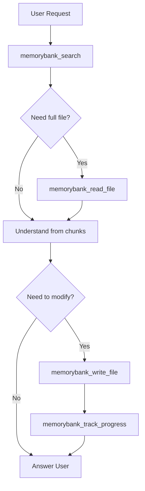

# AGENTS.md - Memory Bank Sandboxed Mode

## Project Configuration

- **Project ID**: `{{PROJECT_ID}}`
- **Workspace**: `{{WORKSPACE_PATH}}`

---

## Memory Bank MCP Instructions - SANDBOXED MODE

⚠️ **IMPORTANT**: In this mode, you do NOT have direct access to the file system.

You MUST use Memory Bank tools for ALL file operations:
- **Reading files**: `memorybank_read_file`
- **Writing files**: `memorybank_write_file`
- **Searching code**: `memorybank_search`

### Available Tools

#### Core Memory Bank (Semantic Search)
| Tool | Description |
|------|-------------|
| `memorybank_index_code` | Index code semantically for search |
| `memorybank_search` | Semantic search in indexed code |
| `memorybank_read_file` | Read file contents |
| `memorybank_write_file` | Write files with auto-reindexing |
| `memorybank_get_stats` | Get Memory Bank statistics |
| `memorybank_analyze_coverage` | Analyze indexing coverage |

#### Project Knowledge Layer (AI Documentation)
| Tool | Description |
|------|-------------|
| `memorybank_generate_project_docs` | Generate AI documentation |
| `memorybank_get_project_docs` | Read project documentation |

#### Context Management (Session Tracking)
| Tool | Description |
|------|-------------|
| `memorybank_initialize` | Initialize Memory Bank for a new project |
| `memorybank_update_context` | Update active context with session info |
| `memorybank_record_decision` | Record technical decisions |
| `memorybank_track_progress` | Update progress tracking |

#### MCP Resources (Direct Access)
| Resource URI | Content |
|--------------|---------|
| `memory://{{PROJECT_ID}}/active` | Current session context |
| `memory://{{PROJECT_ID}}/progress` | Progress tracking |
| `memory://{{PROJECT_ID}}/decisions` | Decision log |
| `memory://{{PROJECT_ID}}/context` | Project context |
| `memory://{{PROJECT_ID}}/patterns` | System patterns |
| `memory://{{PROJECT_ID}}/brief` | Project brief |

### File Operations

#### Reading Files

You CANNOT read files directly. Always use:

```json
{
  "path": "path/to/file.ts",
  "startLine": 1,
  "endLine": 100
}
```

#### Writing Files

You CANNOT write files directly. Always use:

```json
{
  "projectId": "{{PROJECT_ID}}",
  "path": "path/to/file.ts",
  "content": "complete file content here",
  "autoReindex": true
}
```

Note: `memorybank_write_file` automatically reindexes the file when `autoReindex: true`.

#### Searching Code

```json
{
  "projectId": "{{PROJECT_ID}}",
  "query": "describe what you're looking for",
  "topK": 10,
  "minScore": 0.4
}
```

### Session Start

At the beginning of each session:

1. **Update session context**:
   ```json
   {
     "projectId": "{{PROJECT_ID}}",
     "currentSession": {
       "mode": "development",
       "task": "Session start"
     }
   }
   ```

2. **Get current project status**:
   ```json
   {
     "projectId": "{{PROJECT_ID}}",
     "document": "activeContext"
   }
   ```

3. **Get project documentation**:
   ```json
   {
     "projectId": "{{PROJECT_ID}}",
     "document": "summary"
   }
   ```

### Workflow



### Standard Workflow Steps

1. **Search**: `memorybank_search({ projectId: "{{PROJECT_ID}}", query: "..." })`
   - Understand what exists
   - Find relevant code

2. **Context** (if needed): `memorybank_get_project_docs({ projectId: "{{PROJECT_ID}}" })`
   - Get architecture overview
   - Understand patterns

3. **Read** (if needed): `memorybank_read_file({ path: "..." })`
   - Get complete file content
   - See full context

4. **Write** (if modifying): `memorybank_write_file({ projectId: "{{PROJECT_ID}}", path: "...", content: "..." })`
   - Provide complete file content
   - Auto-reindexes by default

5. **Track**: `memorybank_track_progress({ projectId: "{{PROJECT_ID}}", progress: {...} })`
   - Update completed tasks
   - Note any blockers

### Recording Decisions

When making significant technical decisions:
```json
{
  "projectId": "{{PROJECT_ID}}",
  "decision": {
    "title": "Decision title",
    "description": "What was decided",
    "rationale": "Why this decision was made"
  }
}
```

### Important Rules

1. **Never assume file contents** - always read first
2. **Always provide complete file content** when writing
3. **Use the projectId** "{{PROJECT_ID}}" for all operations
4. **Search before reading** - the search may have all info you need
5. **Let autoReindex handle indexing** - no manual index calls needed after writes
6. **Track progress** after completing tasks

### Error Handling

If a tool returns an error:
1. Check the path is correct
2. Verify the projectId matches
3. For writes, ensure content is complete
4. Report the error to the user

---

## Project-Specific Instructions

<!-- Add your project-specific instructions below -->

### Build Commands
- Install: `npm install`
- Build: `npm run build`
- Test: `npm test`

### Code Style
- Follow existing patterns in the codebase
- Use TypeScript strict mode
- Prefer functional patterns

### Important Directories
- `src/` - Source code
- `tests/` - Test files
- `docs/` - Documentation

---

## Notes

- This is **Sandboxed Mode**: no direct file system access
- ALL file operations go through Memory Bank tools
- `memorybank_write_file` auto-reindexes changes
- Progress and decisions are tracked
- All operations use `projectId: "{{PROJECT_ID}}"`
- This mode is ideal for restricted environments or remote development
